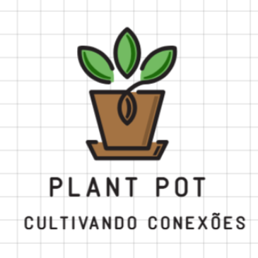

[![Contributors][contributors-shield]][contributors-url]
[![Forks][forks-shield]][forks-url]
[![Stargazers][stars-shield]][stars-url]
[![LinkedIn - Danielli][linkedin-shield]][linkedin-url-dani]
[![LinkedIn - Ricardo][linkedin-shield]][linkedin-url-ricardo]

 

  

  <h3 align="center">🌱 Plant Pot - Cultivando conexões</h3>

  

    Sistema de monitoramento e controle hídrico automatizado
     
    <a href="#descrição"><strong>Ler a Descrição »</strong></a>
     
  

  
Tabela de Conteúdo

  <ol>
    <li>
      <a href="#descrição">Descrição</a>
      <ul>
        <li><a href="#componentes-necessários">Componentes Necessários</a></li>
      </ul>
    </li>
    <li><a href="#funcionalidades-principais">Funcionalidades Principais</a></li>
    <li><a href="#como-usar">Como Usar</a></li>
    <li><a href="#solução-de-problemas">Solução de Problemas</a></li>
    <li><a href="#créditos">Créditos</a></li>
    <li><a href="#contact">Contato</a></li>
  </ol>

## 📋 Descrição

O PlantPot Tamagotchi é um vaso inteligente que monitora a umidade do solo e condições ambientais, controla automaticamente a irrigação da cultura, exibe emoções da planta conforme seu "estado de saúde" e envia todos os dados coletados para a nuvem (ThingSpeak) para monitoramento remoto.

### 🛠 Componentes Necessários
- ESP32 (qualquer versão com Wi-Fi)
- Sensor de Umidade do Solo (capacitivo)
- Sensor DHT11 (temperatura e umidade do ar)
- Display OLED 128x64 (I2C)
- Módulo Relé 5V
- Mini Bomba d'Água 3-5V
- LED de sinalização
- Resistores e jumpers

## ⚙️ Funcionalidades Principais
### Monitoramento Automático:
- Verifica umidade do solo a cada 3 horas;
- Ativa irrigação quando a umidade está baixa
- Detecta excesso de umidade.

### Feedback Visual:
- Display OLED mostra emoções correspondentes ao estado de saúde da planta;
- LED para alertas de mal funcionamento ou falta de água no reservatório;
- Apresentação em gráficos do histórico de leitura dos sensores e ativação da bomba, através da plataforma ThingSpeak.

### Lógica da automação:
- Contadores de aferição são utilizados para monitorar quando é necessária a irrigação e quando a planta está exposta a umidade excessiva;
- A partir de 10 leituras de solo excessivamente seco, o LED é ativado e o Display apresenta a mensagem "Irrig. Comprometida".

## 🚀 Como Usar
1. Compile o código no ESP32;
2. Conecte todos os componentes conforme o esquema; (**desenvolver esquema**)
3. Configure as credenciais de Wi-Fi e API Write do canal do ThingSpeak;
4. Monitore a planta através do display ou remotamente pelos gráficos e reabasteça o reservatório quando necessário.

## ⚠️ Solução de Problemas
**Obs:** Antes de quaisquer validações, verifique se as bibliotecas estão instaladas e atualizadas e se a versão/modelo da placa está correto e atualizado de forma devida.
### Display não funciona:
- Verifique conexões I2C;
- Confira o endereço (0x3C ou 0x3D);
- Teste com exemplo simples da biblioteca `Adafruit_SSD1306`.

### Leituras inconsistentes:
- Verifique posicionamento do sensor no solo;
- Calibre os valores mínimo/máximo conforme as necessidades apresentadas pelo solo utilizado.

## 🙌 Créditos
Desenvolvido por Danielli dos Santos Borges e Ricardo Alexandre Ferreira, sob orientação do Prof° Dr° João Ricardo Favan e coorientação da Prof Dr Eloiza Martins Primo Capeloci, como Trabalho de Graduação da Fatec Shunji Nishimura.

## 📞 Contato

Danielli - [www.linkedin.com/in/danielliborges](LinkedIn) - danielli.borges@fatec.sp.gov.br 
 
Ricardo - [www.linkedin.com/in/ricardo-alexandre-ferreira-35702415a](LinkedIn) - ricardo.ferreira9@fatec.sp.gov.br

Link do Projeto: [https://github.com/Ricardoxt1/plant-pot](https://github.com/Ricardoxt1/plant-pot)

(<a href="#readme-top">voltar ao topo</a>)

[contributors-shield]: https://img.shields.io/github/contributors/Ricardoxt1/plant-pot.svg?style=for-the-badge
[contributors-url]: https://github.com/Ricardoxt1/plant-pot/graphs/contributors
[forks-shield]: https://img.shields.io/github/forks/Ricardoxt1/plant-pot.svg?style=for-the-badge
[forks-url]: https://github.com/Ricardoxt1/plant-pot/network/members
[stars-shield]: https://img.shields.io/github/stars/Ricardoxt1/plant-pot.svg?style=for-the-badge
[stars-url]: https://github.com/Ricardoxt1/plant-pot/stargazers
[linkedin-shield]: https://img.shields.io/badge/-LinkedIn-black.svg?style=for-the-badge&logo=linkedin&colorB=555
[linkedin-url-dani]: https://www.linkedin.com/in/danielliborges/
[linkedin-url-ricardo]: https://www.linkedin.com/in/ricardo-alexandre-ferreira-35702415a/
